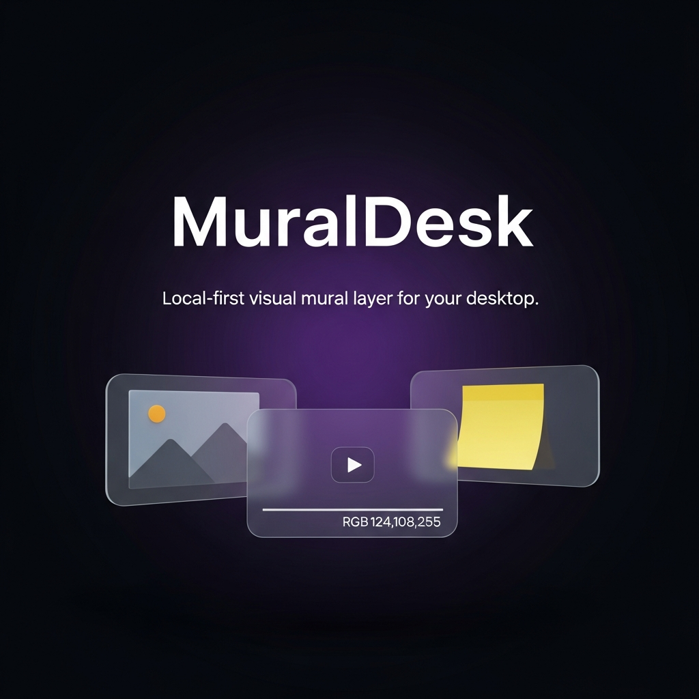

<div align="center">


# MuralDesk

#### A quiet, local-first mural for your desktop.

Pin images, videos, links, and notes onto a transparent overlay that floats over your real workspace — or run the same board as a clean web app in any modern browser.

[](https://www.electronjs.org/)
[](https://react.dev/)
[](https://vitejs.dev/)
[](LICENSE)

<br />

<!-- Branded hero. Generated artwork at docs/assets/muraldesk-hero.png —
     dark premium background with the MuralDesk wordmark and a trio of
     floating cards that hint at the mural feel. -->


<br /><br />

<sub>
  <a href="#getting-started">Getting started</a> ·
  <a href="#desktop-mode">Desktop Mode</a> ·
  <a href="#features">Features</a> ·
  <a href="#tech-stack">Tech stack</a> ·
  <a href="#roadmap">Roadmap</a>
</sub>

</div>

---

## What is MuralDesk?

MuralDesk is a desktop visual board. You drop **images, videos, sticky notes, and links** onto a transparent canvas that floats over your real desktop. Cards stay fully interactive — drag, resize, hover controls — while empty space clicks straight through to whatever's underneath.

It also runs as a clean **Progressive Web App** in any modern browser. Same board, same shortcuts, same files.

## Why it exists

Visual references end up scattered across browser tabs, screenshot folders, second monitors parked on Pinterest, and Slack DMs to yourself.

MuralDesk gives them one quiet wall — pinned *next to* the work, not on top of it. No account, no cloud, no analytics.

---

## Features

### Desktop overlay

- Transparent, frameless window — only the cards are drawn.
- Empty regions click through to the apps underneath.
- System tray with Show / Toggle Desktop Mode / Quit.
- Full-display **Desktop Mode** with an auto-hiding toolbar.

### Content types

| Type | Behavior |
|---|---|
| **Image** | Local file or direct URL → resizable image card. |
| **Video** | Local file or direct URL → silent looping clip with hover controls. |
| **Note** | Editable text card with a small color palette. |
| **Link** | Smart card — see below. |

### Smart embeds

A single Add-Link input becomes the right card based on the URL — no source picker, no manual toggles.

- **YouTube · Vimeo · SoundCloud · Spotify · CodePen** → embedded playable card.
- **Direct image URLs** (`.png` `.jpg` `.gif` `.webp` `.svg`) → image card.
- **Direct video URLs** (`.mp4` `.webm` `.mov` `.ogg`) → playable video card.
- **Anything else** → favicon + title card with **Open** and **Copy URL** chips.

> **Safety.** Anything that isn't `http:` or `https:` (e.g. `javascript:`, `data:`, `file:`) is stripped before a card is ever created — both on paste and on backup import.

### Editing & polish

- Hover any card for a compact mini-toolbar — opacity · fit (cover/contain) · lock · duplicate · delete.
- **Double-click** any card for **Focus mode** — centered, enlarged, dimmed backdrop. `Esc` to exit.
- **Tidy** button shelf-packs every item into a clean grid inside the viewport.
- **Sample Board** to skip the empty state.
- Snap guides while dragging, with a soft 24 px grid.
- A `?` shortcut opens the full keyboard reference inside the app.

### Local-first storage

- **No account. No backend. No cloud.**
- Layout in `localStorage`, media blobs in IndexedDB.
- Per-origin, per-profile — your board never leaves the device unless you export it.

### Backup & export

- One-click **Backup** writes a single portable `.muraldesk.json` file (layout + base64-inlined media).
- **Layout-only Export** for quick sharing without media.
- **Import** auto-detects which of the two formats it's reading.

---

## Desktop Mode

The Electron build is where MuralDesk earns its name.

- The window itself is transparent — your wallpaper and other apps show through unchanged.
- A renderer-side hit-test flips click-through on the fly: cards stay clickable, empty regions don't capture mouse events.
- `Ctrl/Cmd + Shift + D` (or the toolbar button) expands the overlay to cover the current display, using window bounds rather than OS-level fullscreen, so cards can move freely across the whole screen.
- The toolbar tucks into a thin reveal-zone at the top — bring the cursor up to show it again.

---

## Tech stack

| Layer | Choice |
|---|---|
| Renderer | React 18 · Vite 5 |
| Drag / resize | `react-rnd` |
| Desktop shell | Electron 31 |
| Persistence | `localStorage` (layout) · IndexedDB (media blobs) |
| PWA | Hand-rolled `manifest.webmanifest` + service worker |

No backend. No auth. No analytics. No telemetry.

---

## Getting started

> The Electron desktop build needs a real desktop OS (Windows, macOS, or Linux). It can't run inside Replit's container, which lacks the GUI libraries Electron needs at runtime. The web / PWA build runs anywhere.

### Run the web version

```bash
npm install
npm run dev:web
```

Vite serves the renderer at `http://localhost:5000`. For a production build:

```bash
npm run build:web   # static site → dist/
```

### Run the desktop version

```bash
npm install
npm run dev:desktop
```

Spins up a dedicated Vite instance on `http://localhost:5173` and launches Electron pointed at it. Hot-reload works for renderer code; main-process changes need a manual restart.

### Build the Windows `.exe`

```bash
npm run build:desktop
```

Produces:

```
release/MuralDesk-Setup-0.1.0.exe   ← NSIS installer
release/win-unpacked/MuralDesk.exe  ← unpacked binary
```

For a folder build with no installer (quick smoke test):

```bash
npm run build:desktop:dir
```

The installer is unsigned by default — see [Limitations](#current-limitations).

---

## Demo flow

1. Launch MuralDesk.
2. Click **✨ Sample** in the toolbar to load a pre-arranged board.
3. Add an image, video, note, and link of your own.
4. Drag and resize cards. Hover one and drop its opacity to ~40%.
5. Paste a YouTube, Vimeo, SoundCloud, Spotify, or CodePen URL — it auto-becomes an embedded player.
6. **Double-click** a card → Focus mode. `Esc` to exit.
7. Click **▦ Tidy** to shelf-pack everything into a clean grid.
8. Press `Ctrl/Cmd + Shift + D` to enter Desktop Mode. Click empty space to confirm it passes through to whatever's behind.
9. Click **📦 Backup** to export a portable `.muraldesk.json` file.
10. Refresh — everything persists. No upload happened.

---

## Current limitations

- **Not a wallpaper engine.** The overlay is a transparent window drawn *on top of* the desktop, not a layer drawn *under* desktop icons by the OS shell.
- **Unsigned Windows installer.** First-time launchers see SmartScreen and have to click *More info → Run anyway*. Code signing requires a paid certificate.
- **Desktop builds need a real desktop OS.** Replit can't run Electron — use Windows, macOS, or Linux for `dev:desktop` and `build:desktop`.
- **Single-display Desktop Mode.** Desktop Mode covers the current display only; the window remembers which one it last opened on.
- **No cloud sync, by design.** Backup is a manual, explicit step. Adding cloud sync would compromise the local-first promise.
- **Web-version media is per-browser-profile.** IndexedDB is per-origin / per-profile. Use Backup to move between browsers.
- **Some link previews depend on the target site.** Sites that block embedding via `X-Frame-Options` or `Content-Security-Policy` fall back to a favicon + title card.

---

## Roadmap

- Per-monitor overlay windows
- Drag-and-drop file / URL ingestion
- Launch-on-startup (with start-in-tray and start-in-Desktop-Mode flags)
- Theme controls (light / dark / custom accent)
- Additional embed providers
- Wallpaper-layer experiments (Windows-first, exploratory)

---

## License

Released under the **MIT License** — see [LICENSE](LICENSE).
