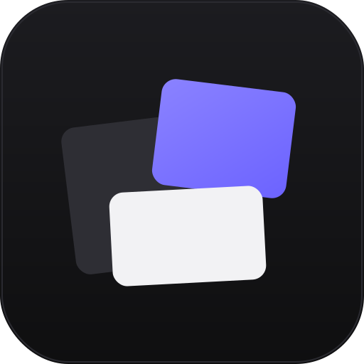

# MuralDesk

A local-first desktop pinboard for the things you want to keep *next to* your work — not buried in tabs, folders, or a second monitor running YouTube.

MuralDesk lets you pin images, looping videos, smart links, and notes onto a transparent layer that floats over your desktop. Click-through empty areas mean you can still use the apps underneath. Everything stays on your machine; nothing is uploaded.



---

## Why I built this

I kept noticing the same pattern across designers, researchers, writers, and developers I work with: when people are *thinking* about something visual — moodboards, references, screenshots, stills from a video, a few key links — they fall back on the same coping strategies:

- **A browser window full of tabs**, each one holding a single image or YouTube video.
- **A folder on the desktop** named `refs/` or `inspo/`, double-clicked open and arranged by hand.
- **A second monitor permanently parked on a Pinterest board** or a YouTube playlist.
- **Slack DMs to themselves** that act as ad-hoc inboxes for screenshots.

These all "work," but they're noisy, they fight for window focus, and they don't survive a reboot. None of them feel like the actual physical mural board you'd pin things to if you had wall space — a quiet visual layer that's just *there* when you glance up.

MuralDesk is my attempt at that quiet layer.

---

## The problem, briefly

> People keep visual references in messy browser tabs, scattered desktop folders, and second monitors playing YouTube — because there's no native, low-friction place to *pin* things on a real computer.

## The solution

> A transparent, click-through pinboard layer that lives on your desktop. Local-first. No accounts. Drop images, videos, and links onto it; arrange them like sticky notes; tab away to your real work; glance back when you need them.

---

## Core features

- **Pin anything visual.** Drag-and-drop or pick local images and videos, paste a URL, write a sticky note. Items snap into place as draggable, resizable cards.
- **Smart links.** Paste a URL and MuralDesk picks the right card type for you:
  - **YouTube** URLs → embedded player (autoplay-muted, loops cleanly).
  - **Direct video URLs** (`.mp4`, `.webm`, `.mov`) → inline `<video>` with mute / loop toggles.
  - **Direct image URLs** (`.png`, `.jpg`, `.gif`, `.webp`) → inline image card.
  - **Anything else** → web preview with favicon, title, and description.
- **Looping videos.** Local video files and direct video links loop silently by default — perfect for ambient reference clips. Hover the card for mute / loop / interact controls.
- **Per-item polish.** Hover any card for a compact toolbar: opacity slider (so a busy reference can fade into the background), object-fit toggle (cover / contain), lock, duplicate, delete.
- **Notes.** Editable text cards with a small palette of colors. No rich text — by design.
- **Empty state, sample board, keyboard shortcuts.** A built-in sample board gets you to "feels real" in one click; `Ctrl/Cmd+Shift+I/V/L` opens the image / video / link pickers.
- **Portable backup.** One-click `.muraldesk.json` export bundles your layout *and* your media (base64-encoded from IndexedDB) into a single file you can drop on another machine. Import auto-detects backup vs. layout-only files.

---

## Electron desktop mode

The web version is already useful, but the Electron build is where MuralDesk earns its name.

- **Transparent, frameless overlay.** The window itself is transparent (`transparent: true`, `frame: false`, `hasShadow: false`, `backgroundColor: '#00000000'`). Only the cards render — the rest of your desktop shows through.
- **Click-through empty areas.** A renderer-side hit-test detects whether the cursor is over a card or over empty board space; empty space forwards mouse events to the OS via Electron's `setIgnoreMouseEvents`. You can keep MuralDesk on top while still clicking, dragging, and selecting in the apps underneath.
- **Desktop Canvas Mode.** A full-display mode (`Ctrl/Cmd+Shift+F` or the toolbar button) that takes the window fullscreen, hides the toolbar to a thin reveal-zone at the top of the screen, and turns the whole display into your mural surface. Toggle it back to a regular window any time.
- **System tray.** Closing the window hides to the tray (Windows/Linux convention) so the mural stays one click away. The tray menu has Show, Toggle Desktop Mode, and Quit.
- **Window state persistence.** Position, size, and maximized state survive restarts via Electron's `app.getPath('userData')` directory.

---

## Local-first storage

Everything you pin stays on your machine. There is no backend, no analytics, no telemetry.

- **Layout metadata** (item positions, sizes, types, opacity, fit, link URLs, note text) lives in `localStorage` under the key `muraldesk-board`. Small, fast, survives reloads.
- **Media bytes** (images and videos you upload) live in **IndexedDB** in a database called `muraldesk`, object store `media`, keyed by a UUID per item. The localStorage layout only stores the UUID; the actual blob is fetched from IndexedDB on load and turned into a `blob:` URL at runtime.
- **Why split them?** localStorage has a ~5 MB hard cap per origin in most browsers — fine for layout JSON, fatal for video files. IndexedDB has no practical size limit and stores binary `Blob`s natively. Splitting the two keeps loads fast and avoids quota-exceeded crashes.
- **Cross-machine portability** is handled by the explicit Backup feature, not by trying to sync IndexedDB across browsers (which doesn't work). The backup file is a single `.muraldesk.json` with media inlined as base64.

---

## PWA / web version

The web build is a full Progressive Web App:

- **Installable** via the browser's "Install app" prompt. On Android it gets a maskable adaptive icon; on iOS it picks up the apple-touch-icon and the standalone status bar.
- **Offline app shell.** A service worker (`public/sw.js`) precaches the HTML, JS, CSS, manifest, and icon set, then serves the app shell from cache when you're offline. Your media is in IndexedDB, which is offline-first by default, so a fully offline launch still shows your board.
- **Branded icon set.** Dark rounded square with a small purple-accented mural — rendered to PNG (192/512), maskable PNG, Apple touch icon, and a multi-size `.ico` favicon.

---

## Running it

### Web (development)

```bash
npm install
npm run dev
```

Vite serves the renderer on `http://localhost:5000`. Open it in any modern browser.

### Web (production build)

```bash
npm run build:web
```

Outputs a static site to `dist/`. Serve it with any static host (`npx serve dist`, GitHub Pages, Netlify, Vercel, your own nginx — all work).

### Desktop (development)

```bash
npm run dev:desktop
```

This script does two things in parallel:
1. Spins up Vite on `http://localhost:5173` (a dedicated `--strictPort` instance so the renderer URL is deterministic).
2. Waits for the Vite server to be reachable, then launches Electron pointed at it via the `ELECTRON_RENDERER_URL` env var.

Hot-reload works for renderer code; main-process changes need a manual restart.

### Desktop (Windows installer)

```bash
npm run build:desktop
```

This runs `npm run build:web` then invokes `electron-builder --win`, producing an NSIS installer at `release/MuralDesk-Setup-<version>.exe`. The installer is unsigned by default (see Limitations below).

For a folder build (no installer, useful for quick smoke tests):

```bash
npm run build:desktop:dir
```

Cross-building from Linux/macOS works because electron-builder ships the NSIS toolchain bundled — no Wine needed for unsigned builds.

---

## Tech stack

| Layer | Choice | Why |
|---|---|---|
| Renderer | React 18 + Vite 5 | Fast HMR, small bundle, no framework lock-in. |
| Drag/resize | `react-rnd` | Battle-tested, handles edge-cases (scaled containers, locked aspect, etc.) so I didn't have to. |
| Desktop shell | Electron 31 | Mature transparent-window support across Windows, macOS, and Linux. |
| Packaging | electron-builder 25 | One-line Windows `.exe`, signed when needed, NSIS by default. |
| Persistence | `localStorage` + IndexedDB | Built into the browser, zero-dependency, offline-first. |

No backend, no auth, no analytics, no proprietary services.

---

## Current limitations

I'm being honest here so you can judge the project on what it actually is, not what a marketing page would imply.

- **Not a true wallpaper engine yet.** The Electron window is transparent and click-through, which gets you 90% of the "feels like wallpaper" experience — but it's still a window, drawn on top of your real wallpaper. A true wallpaper layer (drawn *under* desktop icons by the OS shell) requires platform-specific shell integration (`SHELLDLL_DefView` on Windows, `NSWindowLevel` shenanigans on macOS) that I haven't tackled. The current overlay approach has the upside of working identically on all three OSes, which is why I shipped it first.
- **Multi-monitor support is basic.** The window remembers its position and size, so it reopens on the monitor you left it on. It doesn't yet open a separate mural per display, and Desktop Canvas Mode goes fullscreen on whichever screen the window currently sits on. Power users with three monitors will want more — see Roadmap.
- **Unsigned Windows builds trigger SmartScreen.** The Windows installer is unsigned, so first-time launchers see the "Windows protected your PC" warning and have to click "More info → Run anyway." This is normal for hobby / buildathon builds; signing requires an EV code-signing certificate (~$200/year). Documenting this honestly is more useful than papering over it.
- **No cloud sync, by design.** Backup files are a manual, explicit step. If you want your mural on two machines, you export and import. There's no Dropbox/iCloud auto-sync because adding one would compromise the local-first promise without a clear, opt-in story.
- **Web version's media survives only on the same browser profile.** IndexedDB is per-origin / per-profile, so opening MuralDesk in Chrome and then in Firefox shows two empty boards. Use the Backup feature to move between them.
- **Per-item link previews depend on the target site.** Some sites block embedding via `X-Frame-Options` or `Content-Security-Policy`; those URLs fall back to a card with favicon + title rather than a live preview.

---

## Roadmap

Ordered roughly by what users have asked for and what's tractable next, not by ambition.

- **Multi-monitor windows.** A mural per display, with the option to mirror or treat each display as an independent board.
- **Tray polish.** Show the current board name, expose Add Image / Add Video shortcuts in the tray menu, and add a quick "Lock all items" toggle so the mural can be safely glanced at without accidental drags.
- **Snap guides and grids.** Optional alignment guides when dragging — center-line, edge-snapping, and a soft grid — without forcing a rigid grid layout.
- **Opacity / focus controls at the board level.** A global "dim everything to 30%" toggle for when you want the mural to fade behind your active app, plus a "spotlight" mode that highlights the hovered card.
- **Launch on startup.** Auto-launch the Electron app on login, with a flag to start in tray / start in Desktop Canvas Mode.
- **Wallpaper-layer experiments.** Per-OS exploration of the shell-level wallpaper layer trick. Likely Windows-first because the API surface is the most documented.
- **Optional encrypted backup format.** A passphrase-protected variant of the `.muraldesk.json` export for people who want to email backups to themselves without exposing references.
- **Screenshot capture.** A "snip-and-pin" hotkey that takes a region screenshot and pins it directly to the mural without a save-to-disk roundtrip.

---

## Status

Buildathon project. Working MVP across web (PWA) and Windows (Electron + NSIS installer), with macOS / Linux Electron builds expected to work but not yet exhaustively tested. Pull requests welcome.

## License

The repository is intended for buildathon submission and personal use; a permissive license will be added before any wider release.
